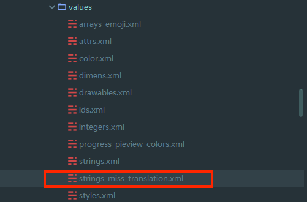
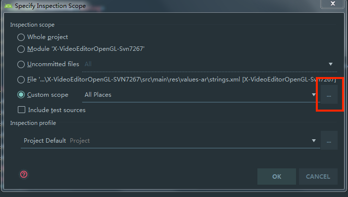
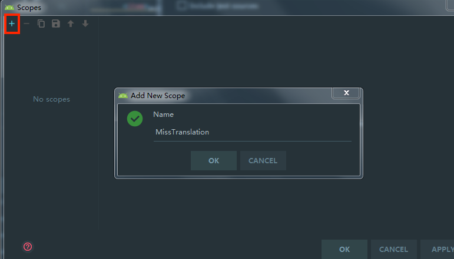
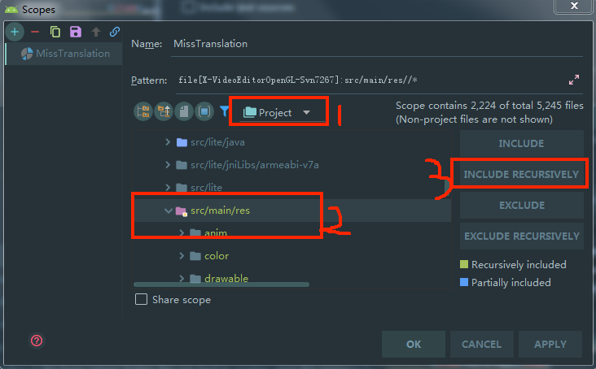
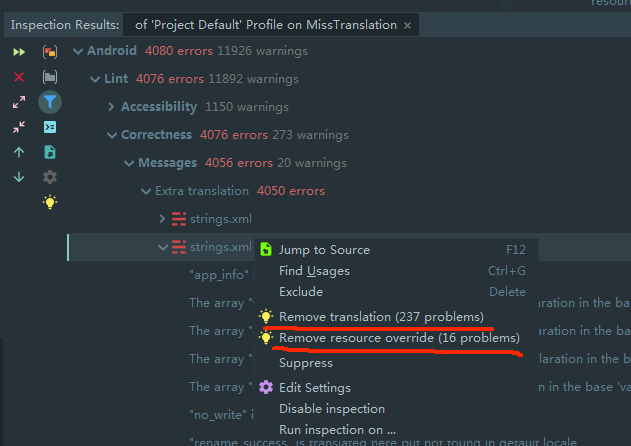

# 删除ExtraTranslation多语言，快速精准操作步骤

1. 便于删除已经不用的多语言
2. 不需要翻译多语言的单独整理，需要翻译的统一
3. ~~防止某个国家的多语言忘了添加（需要删除默认语言的tools:ignore="MissingTranslation"属性，因为需要翻译的国家数量不达标，暂时忽略这条）~~

参考资料（配合资料直接上手操作）：  
[lint android开发者文档](https://developer.android.com/studio/write/lint)  
[Android 性能优化：使用 Lint 优化代码、去除多余资源](https://blog.csdn.net/u011240877/article/details/54141714)

### 如果连默认语言都还没整理，建议先单独整理（如果项目存在变体，整理后运行所有debug变体看看是否有误删除的）或者通过unused resource来删除各种无用资源（如果所有无用资源都删除了就不用往下看了）

### 建议：

不需要翻译的文案（只有英文或者只有中文之类的），可以单独写在默认values文件夹中一个xml\(需要tools:ignore="MissingTranslation"属性\)文件中，以后整理翻译的时候也方便自己

## 第一步，去除除了默认语言外其他语言的`ExtraTranslation`设置

xmlns:tools="[http://schemas.android.com/tools](http://schemas.android.com/tools)"  
~~tools:ignore="ExtraTranslation"~~&gt;

## 工具栏 -&gt; Analyze -&gt; Inspect Code…

默认是检查整个项目，我们可以点击 Custom scope 自定义检查范围。  
通过选择特定的类进行检查，点击下图中的红色框部分：

之后会弹出自定义范围选择框，默认是空的，我们可以点击左上角的“+”号新增一个检查范围，选择local，新建一个自己命名的检查范围：

上图中右边的四个按钮表示要操作的类型：

Include：包括当前文件夹内的文件，但不包括他的子文件夹  
Include Recursively：包括当前文件夹以及它的子文件夹内所有的文件夹，递归添加  
Exclude：移除当前文件夹，不包括子文件夹  
Exclude Recursively：移除当前文件夹及所有子文件夹  
我们点击左边的 app 文件夹后，选中多语言父目录\(最好逐个添加各个国家的values文件夹，节省lint检查时间\)，点击右边的 Include Recursively 按钮，把所有strings文件添加到检查列表：

可以看到，选中文件都变绿了，点击 OK 进行检测，稍等一会儿，会弹出 Inspection 对话框，显示检查结果 

  
在图示位置可以看到多余的多语言，**通过以上方式就可以快速删除（记得多选再右键删除）** 

